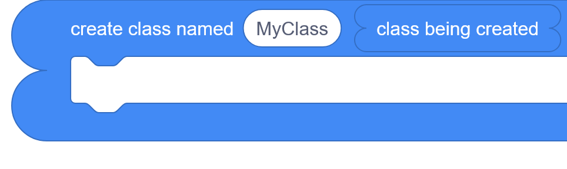
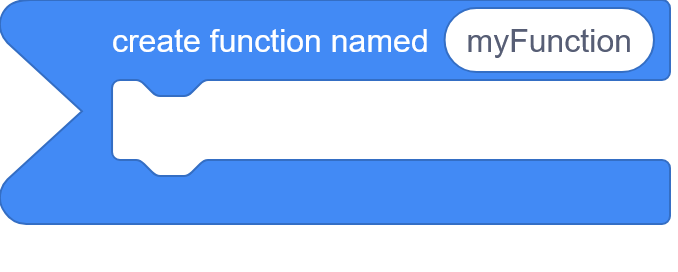

# OOP Extension

**The OOP extension** by [GermanCodeEngineer](https://github.com/GermanCodeEngineer/) provides Python-like object-oriented programming features in PenguinMod blocks.
> Highlights: **scoped variables**, **functions with defaults**, **classes and inheritance**, **getters/setters**, **operator methods**, **static methods**, **introspection**, and the special **`Nothing`** value.

Contents:
- [Feature List](#features)
- [Block List](#blocks)
- [Supported Languages](#supported-languages)

Thanks to [jwklong](https://github.com/jwklong), [DogeisCut](https://github.com/dogeiscut), [Sharkpool](https://github.com/SharkPool-SP) and especially [**VeryGoodScratcher42**](https://github.com/Lego7set) for inspiration.

# Features

The OOP extension brings structured **object-oriented programming** and **scope-aware functions** into block-based projects.

## Quick Notes
- **Flexible inputs:** When a block expects a **class**, **instance**, or **function**, you can usually give either the value itself or the **name of a variable** that stores it.
- **Scope behavior:** Variables are resolved at **runtime** and only within the current **PM Script**. If you want to modify or delete an outer variable from inside a nested scope, **bind it first**.
- **Default arguments:** Default values automatically fill the **last positional arguments** when those trailing inputs are left out.
- **Class variables:** These are specially supported with blocks to **set**, **get**, **delete**, and **list** them.
- **`as string`:** This converts a value to readable text. For class instances, it calls the special **`as string`** method when one is defined.

## Block and Input Shapes
In this extension, the shapes of reporters indicate the **type of value**, they return. Input shapes indicate in the same way which type of value, they expect. Here are some examples for the existing shapes:
### Class

### Class Instance

### Function

### Nothing

### Array (extension by jwklong)

### Object (extension by dogeiscut)

### Any value (Normal round reporter)


## Scoped Variables and Scope Control
- Create, read, update, and delete variables in the **current scope**.
- Check whether a variable exists in **local**, **global**, or **all visible** scopes.
- Create temporary **local variable scopes** for safer nested logic.
- **Bind global or non-local variables** into the current scope so changes stay linked instead of copied.
- Variable context is limited to the current **PenguinMod Script** (e.g. a green flag block and the blocks below it), and outer names are resolved **at runtime**.
- Handle shadowing naturally: when the same name exists in multiple scopes, the **innermost** one is used first.
- **Note:** When using **broadcast blocks**, **custom blocks**, or other control features that start scripts in a new thread, the new script runs in its own thread with a separate local scope. This means any local variables from the calling scope are **not available** in the new script. Local variables do **not carry over** between threads or scripts started by these control features.

### Examples for Scoped Variables
```scratch
set var [myGlobalVar] to [hello world] in current scope::#428af5
create function at var [myFunction] {
	\/\/ set a local variable for this scope::#949494
	set var [myLocalVar] to [bye world] in current scope::#428af5
	...
	\/\/ see below::#949494
	my custom block
	broadcast (my broadcast v)
	...
	\/\/ you can read a variable from an upper scope::#949494
	say (get var [myGlobalVar]::#428af5)
	\/\/ or local scope...::#949494
	say (get var [myLocalVar]::#428af5)
	...
	
	\/\/ to change or delete a global var, bind it first::#949494
	bind [global v] variable [myGlobalVar] to current scope::#428af5
	delete var [myGlobalVar] in current scope::#428af5
	...
	
	create local variable scope {
		\/\/ local variables are available even in inward scopes::#949494
		\/\/ example: (all variables in [all scopes v]::#428af5) is [\["myGlobalVar", "myLocalVar"\]]::#949494
		\/\/ even though it does not count as local scope anymore::#949494
		\/\/ example: (all variables in [local scope]::#428af5) is [\[\]]::#949494
		\/\/ you can also just list global vars::#949494
		\/\/ example: (all variables in [global scope]::#428af5) is [\["myGlobalVar"\]]::#949494
	}::#428af5
}::#428af5
execute expression (call function [myFunction] with positional args ()::#428af5)::#428af5
\/\/ local variables are not available outside their scope::#949494
\/\/ example: (all variables in [all scopes v]::#428af5) is [\["myGlobalVar"\]] ::#949494

define my custom block
\/\/ local variables from the caller are not available e.g. <var [myLocalVar] exists in [all scopes v]?::#428af5> is <false::operators> ::#949494
\/\/ global variables are of course available e.g. <var [myGlobalVar] exists in [all scopes v]?::#428af5> is <true::operators>::#949494

when I receive [my broadcast v]
\/\/ local variables from the caller are not available e.g. <var [myLocalVar] exists in [all scopes v]?::#428af5> is <false::operators> ::#949494
\/\/ global variables are of course available e.g. <var [myGlobalVar] exists in [all scopes v]?::#428af5> is <true::operators>::#949494
```

---

## Functions and Closures
- Create functions either **to store them in a variable** or **in a reporter block**.
- Configure the **next function's argument names and default values** before defining it.
- Default values fill the **last positional arguments** automatically when those trailing inputs are omitted.
- Call functions with positional arguments.
- Functions and methods can **capture outer variables** from where they were defined.
- Use `return` to exit a function or method cleanly with a result.

### Examples for Functions
```scratch
\/\/ Class Definitions work in a similar way to function definitions \(see above\) ::#949494
\/\/ Create a global class ::#949494
create class at var [MyClass] (current class::#428af5) {
	configure next function: argument names (parse [\["arg1", "arg2"\]] as an array::#ff513d) defaults (parse [\["default for arg 2"\]] as an array::#ff513d)::#428af5
	definẹ instance method [myMethod] (self::#428af5) {
		...
	}::#428af5
	...
	\/\/ Instead of ::#949494
	on [MyClass] set class var [myVariable] to [100]::#428af5
	\/\/ Use (current class::#428af5) to e.g. set a class variable ::#949494
	on (current class::#428af5) set class var [myClassVariable] to [100]::#428af5
}::#428af5

\/\/ Interesting Case: Subclasses ::#949494
create subclass at var [MySubclass] with superclass [MyClass] (current class::#428af5) {
	definẹ instance method [mySimpleMethod] (self::#428af5) {
		// Subclasses of course inherit: ::#949494
		return ((get class var [myClassVariable] of [MyClass]::#428af5) + (on (self::#428af5) call method [myMethod] with positional args (parse [\["lorem ipsum", 54\]] as an array::#ff513d)::#428af5))::#428af5
	}::#428af5
}::#428af5

\/\/ To edit a class after defining it: ::#949494
on class [MyClass] (current class::#428af5) {
	definẹ instance method [myAddedMethod] (self::#428af5) {
		...
	}::#428af5
}::#428af5
on class [MySubclass] (current class::#428af5) {
	on (current class::#428af5) set class var [myClassVariable] to [200]::#428af5
}::#428af5

\/\/ Example: get class variable of super class ::#949494
wait (get class var [myClassVariable] of (get superclass of [MySubclass]::#428af5)::#428af5) seconds
```

---

## Classes and Inheritance
- Create classes and subclasses either **in a variable** or **in a reporter block**.
- All class-related inputs accept either the **class value itself** or the **name of a variable** holding that class.
- Re-open an existing class with **`on class`** to add more members later.
- Access **`current class`** while inside a class-definition context.
- Check subclass relationships and retrieve a class's **superclass**.

### Examples for Classes
```scratch
\/\/ Class Definitions work in a similar way to function definitions \(see above\) ::#949494
\/\/ Create a global class ::#949494
create class at var [MyClass] (current class::#428af5) {
	configure next function: argument names (parse [\["arg1", "arg2"\]] as an array::#ff513d) defaults (parse [\["default for arg 2"\]] as an array::#ff513d)::#428af5
	definẹ instance method [myMethod] (self::#428af5) {
		...
	}::#428af5
	...
	\/\/ Instead of ::#949494
	on [MyClass] set class var [myVariable] to [100]::#428af5
	\/\/ Use (current class::#428af5) to e.g. set a class variable ::#949494
	on (current class::#428af5) set class var [myClassVariable] to [100]::#428af5
}::#428af5

\/\/ To edit a class after defining it: ::#949494
on class [MyClass] (current class::#428af5) {
	definẹ instance method [myAddedMethod] (self::#428af5) {
		...
	}::#428af5
	...
	on (current class::#428af5) set class var [myClassVariable] to [200]::#428af5
}::#428af5

\/\/ Interesting Case: Subclasses ::#949494
create subclass at var [MySubclass] with superclass [MyClass] (current class::#428af5) {
	definẹ instance method [mySimpleMethod] (self::#428af5) {
		// Subclasses of course inherit: ::#949494
		return ((get class var [myClassVariable] of [MyClass]::#428af5) + (on (self::#428af5) call method [myMethod] with positional args (parse [\["lorem ipsum", 54\]] as an array::#ff513d)::#428af5))::#428af5
	}::#428af5
}::#428af5
```

---

## Methods, Accessors, and Custom Behavior
- Define **instance methods** (including special methods like `init` and `as string`).
- Define **static methods**.
- Define **getters** and **setters** to control attribute reads and writes.
- Define **operator methods** to customize how instances behave with operators.
- Use helper values like **`self`**, **`value`**, and **`other value`** inside the appropriate method contexts.
- Call parent-class behavior with **`call super method`** and **`call super init method`**.

### Examples for Methods, Accessors, and Operators
```scratch
\/\/ Methods, getters, setters, operator methods, and static methods must be defined inside a class definition. ::#949494
create class at var [MyClass] (current class::#428af5) {
	\/\/ Define an instance method ::#949494
	definẹ instance method [greet] (self::#428af5) {
		say (join [Hello, ] (on (self::#428af5) get attribute [name]::#428af5))
	}::#428af5

	\/\/ Define a getter and setter ::#949494
	definẹ getter [score] (self::#428af5) {
		return (on (self::#428af5) get attribute [internalScore]::#428af5) ::#428af5
	}::#428af5
	definẹ setter [score] (self::#428af5) (value::#428af5) {
		on (self::#428af5) set attribute [internalScore] to (value::#428af5) ::#428af5
	}::#428af5

	\/\/ Define an operator method ::#949494
	definẹ operator method [left add v] (other value::#428af5) {
		return ((on (self::#428af5) get attribute [score]::#428af5) + (other value::#428af5))::#428af5
	}::#428af5

	\/\/ Define a static method ::#949494
	definẹ static method [describe] {
		say [This is a static method.]
	}::#428af5
}::#428af5

\/\/ Special methods and super calls ::#949494
create class at var [MyClass] (current class::#428af5) {
	\/\/ Special method: init \(runs when a new instance is created\) ::#949494
	definẹ [init v] instance method (self::#428af5) {
		on (self::#428af5) set attribute [name] to [Bob] ::#428af5
		on (self::#428af5) set attribute [internalScore] to [0] ::#428af5
	}::#428af5

	\/\/ Special method: as string for (() as string::#428af5) ::#949494
	definẹ [as string v] instance method (self::#428af5) {
		return (join (on (self::#428af5) get attribute [name]::#428af5) (on (self::#428af5) get attribute [internalScore]::#428af5)) ::#428af5
	}::#428af5
}::#428af5

create subclass at var [MySubclass] with superclass [MyClass] (current class::#428af5) {
	definẹ [init v] instance method (self::#428af5) {
		\/\/ Call the superclass init method ::#949494
		call super init method with positional args (blank array::#ff513d)::#428af5
		on (self::#428af5) set attribute [extra] to [something]::#428af5
	}::#428af5
	definẹ instance method [greet] (self::#428af5) {
		\/\/ Call the superclass greet method ::#949494
		call super method [greet] with positional args (blank array::#ff513d)::#428af5
		say [Welcome to MySubclass!]
	}::#428af5
}::#428af5
```

## Instances, Attributes, and Introspection
- Create instances with positional arguments passed to `init`.
- Use either the instance itself or the **name of a variable** holding it as input where an instance is expected.
- Read and write attributes directly, or route access through getters and setters.
- Get **all attributes** of an instance for quick inspection.
- Check whether a value **is an instance of** a class.
- Get the class of an instance.
- Compare identity between values (check if two values are exactly the same instance).
- Inspect the type of a value.
- List class members by category.
- Work with **class variables** using dedicated set/get/delete/list blocks for class-level metadata.

### Examples for Instances, Attributes, and Introspection
```scratch
\/\/ Create an instance and set attributes ::#949494
set var [bob] to (create instance of class [MyClass] with positional args (parse [\["Bob"\]] as an array::#ff513d)::#428af5) in current scope::#428af5
on [bob] set attribute [score] to [42]::#428af5

\/\/ Get an attribute ::#949494
say (on [bob] get attribute [score]::#428af5)

\/\/ Call an instance method ::#949494
on [bob] call method [greet] with positional args (blank array::#ff513d)::#428af5

\/\/ Introspection ::#949494
(get class of [bob]::#428af5) // <Class 'MyClass'(super 'Superclass')>
(all attributes of [bob]::#428af5) // {"score": 42}
(typeof [bob]::#428af5) // Class Instance (GCE)
<typeof [bob] is (Class Instance \(GCE\) v) ?::#428af5> // true
<is [bob] an instance of [MyClass] ?::#428af5> // true
```

## Special Values and Utilities
- Use **`Nothing`** as a stable no-value similar to Python's `None`.
- Convert values to readable text with **`as string`**. On class instances that define it, this calls the special **`as string`** method.
- Use **`execute expression`** to evaluate reporter blocks inside scripts.
- Use the debugging helper to inspect the current **thread stacks and scopes** when needed.

### Examples for Special Values and Utilities
```scratch
\/\/ Using Nothing ::#949494
set var [result] to (call function [myFunction] with positional args (blank array::#ff513d)::#428af5) in current scope::#428af5
if <[result] is (Nothing::#428af5) ?::#428af5> then
	say [No result!]
end

\/\/ as string \(allows live custom representation\) ::#949494
say ([bob] as string::#428af5)

\/\/ typeof ::#949494
say (typeof [bob]::#428af5)

\/\/ execute expression ::#949494
\/\/ this helps you use a reporter in a script if you don't care about the return value ::#949494
execute expression (call function [myFunction] with positional args (parse ["Bob"] as an array::#ff513d)::#428af5)::#428af5
```
- Use **`Nothing`** as a stable no-value similar to Python's `None`.
- Convert values to readable text with **`as string`**. On class instances that define it, this calls the special **`as string`** method.
- Use **`execute expression`** to evaluate reporter blocks inside scripts.
- Use the debugging helper to inspect the current **thread stacks and scopes** when needed.

# Blocks

## Scoped Variables
---
```scratch
set var [myVar] to [my value] in current scope::#428af5
```
- Creates or updates a variable in the current scope.

---
```scratch
(get var [myVar]::#428af5)
```
- Gets the value of a variable visible from the current or outer scopes.

---
```scratch
<var [myVar] exists in [all scopes v]?::#428af5>
<var [myVar] exists in [local scope v]?::#428af5>
<var [myVar] exists in [global scope v]?::#428af5>
```
- Checks whether a variable exists in the selected scope range.

---
```scratch
delete var [myVar] in current scope::#428af5
```
- Deletes a variable from the current scope.

---
```scratch
(all variables in [all scopes v]::#428af5)
(all variables in [local scope v]::#428af5)
(all variables in [global scope v]::#428af5)
```
- Returns all variable names visible in the selected scope range as an array.

---
```scratch
create local variable scope {
}::#428af5
```
- Runs the enclosed blocks inside a new local variable scope.

---
```scratch
bind [non-local v] variable [myVar] to current scope::#428af5
bind [global v] variable [myVar] to current scope::#428af5
```
- Links a global or non-local variable into the current scope. Because scope resolution happens at runtime, bind outer variables first if you want to modify or delete them from an inner scope.

<br><br>
## Define Classes

---
```scratch
create class at var [MyClass] (current class::#428af5) {
}::#428af5
```
- Creates a new class, stores it in the chosen variable.

---
```scratch
create subclass at var [MySubclass] with superclass [MyClass] (current class::#428af5) {
}::#428af5
```
- Creates a subclass with the given superclass, stores it in a variable.

---
```scratch
create class named [MyClass] (current class::#428af5) {

}::#428af5
```
- *Note: This block is really a reporter with a branch, but it can not be rendered accurately here.*
- Creates and returns a new class with the given name.

---
```scratch
create subclass named [MySubclass] with superclass [MyClass] (current class::#428af5) {
}::#428af5
```
- *Note: This block is really a reporter with a branch, but it can not be rendered accurately here.*
- Creates and returns a new subclass with the given superclass.

---
```scratch
on class [MyClass] (current class::#428af5) {
}::#428af5
```
- Runs the enclosed blocks as if they were inside the selected class definition. This allows you to e.g. add methods to already defined classes.

---
```scratch
(current class::#428af5)
```
- Returns the class currently being defined.

<br><br>
## Use Classes

---
```scratch
<is [MySubclass] a subclass of [MyClass] ?::#428af5>
```
- Checks whether one class inherits from another.

---
```scratch
(get superclass of [MySubclass]::#428af5)
```
- Returns the superclass of a class, or Nothing if it has none.

<br><br>
## Class Members

### Define Instance Methods

---
```scratch
definẹ instance method [myMethod] (self::#428af5) {
}::#428af5
```
- Defines an instance method on the current class.

---
```scratch
definẹ [init v] instance method (self::#428af5) {
}::#428af5
definẹ [as string v] instance method (self::#428af5) {
}::#428af5
```
- Defines a special instance method.

---
```scratch
(self::#428af5)
```
- Reports the current instance inside a method.

---
```scratch
(call super method [myMethod] with positional args (parse [\["argument1", "argument2"\]] as an array::#ff513d)::#428af5)
```
- Calls an instance method from the superclass of the current object.

---
```scratch
(call super init method with positional args (parse [\["argument1", "argument2"\]] as an array::#ff513d)::#428af5)
```
- Calls the superclass init method for the current object.

<br><br>
### Define Getters & Setters

---
```scratch
definẹ getter [myAttr] (self::#428af5) {
}::#428af5
```
- Defines a getter method for an attribute on the current class.

---
```scratch
definẹ setter [myAttr] (self::#428af5) (value::#428af5) {
}::#428af5
```
- Defines a setter method for an attribute on the current class.

---
```scratch
(value::#428af5)
```
- Reports the incoming value inside a setter method.

<br><br>
### Define Operator Methods

---
```scratch
definẹ operator method [left add v] (other value::#428af5) {
}::#428af5
definẹ operator method [right add v] (other value::#428af5) {
}::#428af5
// AND MANY MORE
definẹ operator method [right mod v] (other value::#428af5) {
}::#428af5
definẹ operator method [greater or equal v] (other value::#428af5) {
}::#428af5
// AND MANY MORE
```
- Defines custom behavior for an operator on instances of the current class.

---
```scratch
(other value::#428af5)
```
- Reports the other operand inside an operator method.

<br><br>
### Define Static Methods & Class Variables

---
```scratch
on [MyClass] set class var [myVariable] to [my value]::#428af5
```
- Sets a class variable on the selected class.

---
```scratch
(get class var [myVariable] of [MyClass]::#428af5)
```
- Gets a class variable from the selected class.

---
```scratch
on [MyClass] delete class var [myVariable]::#428af5
```
- Deletes a class variable from the selected class.

---
```scratch
definẹ static method [myMethod] {
}::#428af5
```
- Defines a static method on the current class.

---
```scratch
([instance method v] names of class [MyClass]::#428af5)
([static method v] names of class [MyClass]::#428af5)
([getter method v] names of class [MyClass]::#428af5)
([setter method v] names of class [MyClass]::#428af5)
([operator method v] names of class [MyClass]::#428af5)
([class variable v] names of class [MyClass]::#428af5)
```
- Returns the names of members of the selected type for a class.

<br><br>
## Working with Instances

<br><br>
### Create & Inspect

---
```scratch
(create instance of class [MyClass] with positional args (parse [\["argument1", "argument2"\]] as an array::#ff513d)::#428af5)
```
- Creates an instance of a class and passes the given positional arguments to its `init` method. The class input can be either a class value or the name of a variable holding one.

---
```scratch
<is [my instance] an instance of [MyClass] ?::#428af5>
```
- Checks whether an instance belongs to a class or one of its subclasses.

---
```scratch
(get class of [my instance]::#428af5)
```
- Returns the class that created an instance.

<br><br>
### Attributes

---
```scratch
on [my instance] set attribute [myAttr] to [my value]::#428af5
```
- Sets an attribute on an instance or calls its setter if one exists.

---
```scratch
(on [my instance] get attribute [myAttr]::#428af5)
```
- Gets an attribute from an instance or calls its getter if one exists.

---
```scratch
(all attributes of [my instances]::#428af5)
```
- Returns all direct instance attributes as an object.

<br><br>
### Call Methods

---
```scratch
(on [my instance] call method [myMethod] with positional args (parse [\["argument1", "argument2"\]] as an array::#ff513d)::#428af5)
```
- Calls an instance method on an object with positional arguments. The instance input can be either the instance itself or the name of a variable holding it.

---
```scratch
(on [MyClass] call static method [myMethod] with positional args (parse [\["argument1", "argument2"\]] as an array::#ff513d)::#428af5)
```
- Calls a static method on a class with positional arguments. The class input can be either the class itself or the name of a variable holding it.

---
```scratch
(get static method [myMethod] of [MyClass] as function::#428af5)
```
- Returns a static method from a class as a callable function value.

<br><br>
## Functions

<br><br>
### Configure Before Define

---
```scratch
configure next function: argument names (parse [\["person", "message"\]] as an array::#ff513d) defaults (parse [\["Hello World!"\]] as an array::#ff513d)::#428af5
```
- Configures the argument names and default values used by the next function or method definition. Default values fill the last positional arguments when those trailing inputs are omitted.

<br><br>
### Define

---
```scratch
create function at var [myFunction] {
}::#428af5
```
- Creates a function and stores it in the chosen variable.

---
```scratch
create function named [myFunction] {
}::#428af5
```
- *Note: This block is really a reporter with a branch, but it can not be rendered accurately here.*
- Creates and returns a function with the given name.

<br><br>
### Inside Functions & Methods

---
```scratch
return [my value]::#428af5 cap
```
- Returns a value from the current function or method and exits it.

---
```scratch
(call function [myFunction] with positional args (parse [\["Bob", "Goodbye."\]] as an array::#ff513d)::#428af5)
```
- Calls a function value with positional arguments. The function input can be either the function itself or the name of a variable holding it.

<br><br>
### Utilities

---
```scratch
([my instance] as string::#428af5)
```
- Converts a value to its string form. On class instances that implement it, this calls the special `as string` method automatically.

---
```scratch
(typeof <true::operators>::#428af5)
(typeof (blank array::#ff513d)::#428af5)
(typeof (blank object::#f9bb58)::#428af5)
(typeof [my instance]::#428af5)
// And many more
```
- Returns a readable type name for a value.
- You can see the list of types when using the block below.

---
```scratch
<typeof (self::#428af5) is (Class Instance \(GCE\) v) ?::#428af5>
<typeof (get var [myVar]::#428af5) is (String v) ?::#428af5>
<typeof (blank array::#ff513d) is (Array \(jwklong\) v) ?::#428af5>
```
- Check if a value is of a specific type.

---
```scratch
<[my instance] is [other instance] ?::#428af5>
```
- Checks whether two values are exactly the same value (the same instance).

---
```scratch
(Nothing::#428af5)
```
- Returns the cool Nothing value like None in python.

---
```scratch
execute expression (call function [myFunction] with positional args (parse [\["Bob", "Goodbye."\]] as an array::#ff513d)::#428af5)::#428af5
```
- Evaluates the input expression without performing any additional action. This allows you to e.g. use the function call block (a reporter) in a script.

# Supported Languages
> **Error messages and block names and tooltips are available in English and German.** Many things (like menus or value representation) can not be translated, as in many cases that would result in different behaviour depending on the used language.<br>
> *Note:* Because error messages are translated, you can **not rely** on an error message always to always use the same format.
